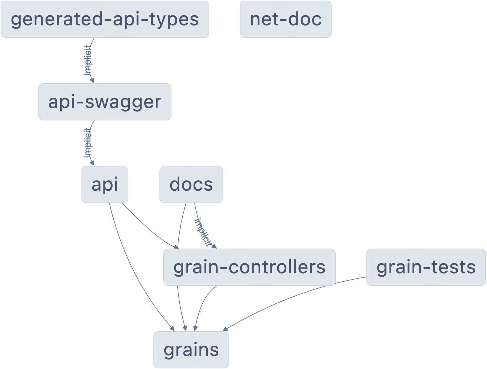

# NX + dotnet + Orleans + OpenApi- generator

<a alt="Nx logo" href="https://nx.dev" target="_blank" rel="noreferrer"></a>

✨ **This workspace has been generated by [Nx](https://nx.dev)** and [@nx-dotnet](https://www.nx-dotnet.com/docs/)

## Quick Start
Start with `pnpm install` (`npm install -g pnpm` if you don't have it)

And then `pnpm serve`  

## Projects
- [api](./api) - ASP.NET Core Web API application
- [grains](./libs/grains) - Orleans Grains
- [grain-controllers](./libs/grain-controllers) - Controllers for the Orleans Grains
- [grain-tests](./libs/grain-tests) - Test project for the Orleans Grains

## Generated Code
- [generated/docs](./generated/docs/references) - Docfx - dotnet documentation, generated from the source code
- [generated/api-swagger](./generated/api-swagger) - OpenAPI spec for the API, generated from the ASP.NET Core Web API
- [generated/api-types](./generated/api-types) - Typescript client code for the API, generated from the OpenAPI spec

 
### Extending Generated Code
You can extend the generation flow by adding more tasks to the api-swagger and api-types projects.
Example of adding genration entry to the `api-swagger` project:

```json
{
  "angulargen":{
    "executor": "nx:run-commands",
    "options": {
      "command": "pnpx openapi-typescript-codegen  openapi generate-ts  -o generated/angular -i generated/api-swagger/swagger.json --client angular --useUnionTypes --exportModels false --name myapp "
    },
    "outputs": ["{workspaceRoot}/demo/libs/generated/angular"],
    "dependsOn": ["^swagger"]
  }
}
```


